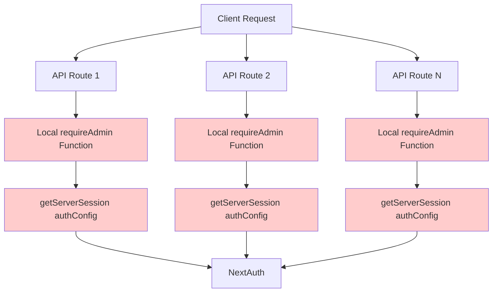
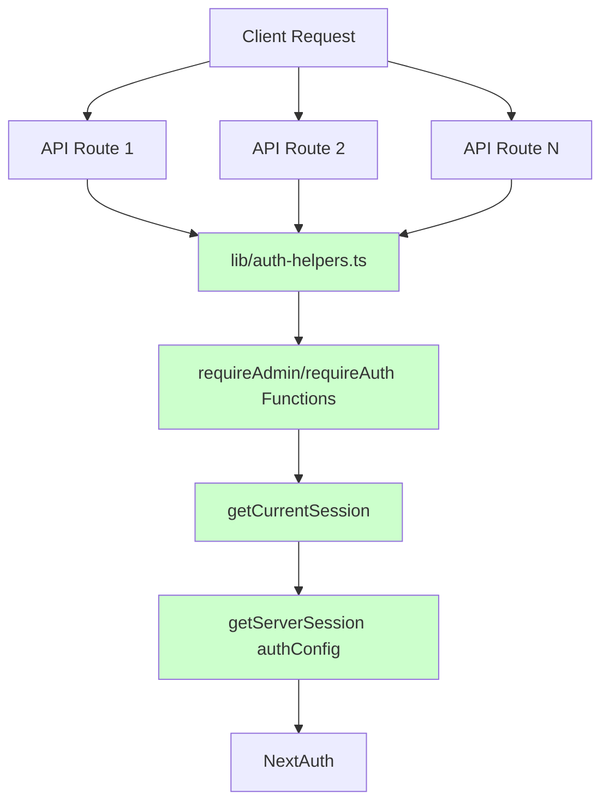
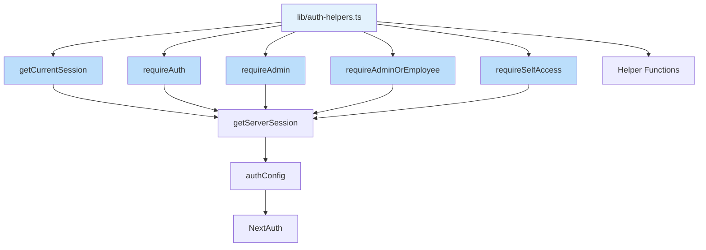
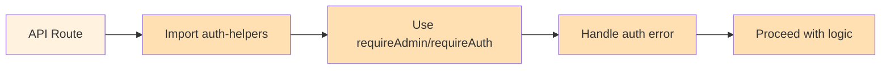

# 🏗️ Arsitektur Autentikasi - Sebelum dan Sesudah

## 📊 Current State (Problematic)



### Masalah Arsitektur Saat Ini:
- ❌ **60+ duplikat fungsi `requireAdmin`**
- ❌ **6+ duplikat fungsi `requireAuth`**
- ❌ **Inkonsistensi implementasi**
- ❌ **Maintenance difficulties**
- ❌ **Code duplication**

## 🎯 Target State (Solution)



### Keuntungan Arsitektur Baru:
- ✅ **Single source of truth** untuk autentikasi
- ✅ **Consistent implementation** di semua routes
- ✅ **Easy maintenance** dan updates
- ✅ **Better security** dengan centralized logging
- ✅ **Reduced code duplication**

## 🔄 Migration Flow

```mermaid
flowchart LR
    A[Identify Duplication] --> B[Create Centralized Helpers]
    B --> C[Refactor High-Priority Routes]
    C --> D[Test Functionality]
    D --> E[Refactor Remaining Routes]
    E --> F[Cleanup Unused Code]
    F --> G[Final Testing]
    G --> H[Deploy]
    
    style A fill:#ffeb3b
    style B fill:#ffeb3b
    style C fill:#4caf50
    style D fill:#4caf50
    style E fill:#2196f3
    style F fill:#2196f3
    style G fill:#4caf50
    style H fill:#4caf50
```



## 📋 Implementation Layers

### Layer 1: Foundation (lib/auth-helpers.ts)


### Layer 2: API Routes


## 🎯 File Structure Impact

### Before:
```
app/api/
├── inventory/
│   ├── barang/route.ts (has local requireAdmin)
│   ├── masuk/route.ts (has local requireAdmin)
│   └── keluar/route.ts (has local requireAdminOrEmployee)
├── olts/
│   ├── route.ts (has local requireAdmin)
│   └── [id]/route.ts (has local requireAdmin)
└── ... (60+ more files with duplicated functions)
```

### After:
```
lib/
├── auth.ts (core auth config)
├── auth-helpers.ts (NEW - centralized functions)
└── route-protection.ts (may be simplified)

app/api/
├── inventory/
│   ├── barang/route.ts (imports from auth-helpers)
│   ├── masuk/route.ts (imports from auth-helpers)
│   └── keluar/route.ts (imports from auth-helpers)
├── olts/
│   ├── route.ts (imports from auth-helpers)
│   └── [id]/route.ts (imports from auth-helpers)
└── ... (all files import from auth-helpers)
```

## 📊 Metrics Impact

| Metric | Before | After | Improvement |
|--------|--------|--------|-------------|
| Lines of Code (Auth Functions) | ~1,800 | ~200 | -89% |
| Files with Auth Logic | 60+ | 1 | -98% |
| Maintenance Points | 60+ | 1 | -98% |
| Consistency Issues | High | None | 100% |
| Security Coverage | Inconsistent | Complete | 100% |

## 🔄 Refactor Pattern

### Before Pattern:
```typescript
// In every API file
async function requireAdmin() {
  const session: any = await getServerSession(authConfig as any)
  if (!session || false) {
    return null
  }
  return session
}

// Usage
const session = await requireAdmin()
if (!session) return NextResponse.json({ error: 'Unauthorized' }, { status: 401 })
```

### After Pattern:
```typescript
// One import
import { requireAdmin } from '@/lib/auth-helpers'

// Direct usage
const authError = await requireAdmin(request)
if (authError) return authError
```

## 🚀 Benefits Summary

### Development Benefits:
- **Faster Development**: No need to write auth logic
- **Consistent Behavior**: Same auth logic everywhere
- **Easier Debugging**: Single place to check auth issues
- **Better IDE Support**: Autocomplete for auth functions

### Maintenance Benefits:
- **Single Update Point**: Change auth logic once
- **Reduced Bugs**: Less code = fewer bugs
- **Easier Testing**: Test auth logic in isolation
- **Better Documentation**: One place to document auth

### Security Benefits:
- **Consistent Security**: Same security rules everywhere
- **Centralized Logging**: All auth events in one place
- **Easier Audits**: Single file to audit
- **Quick Security Updates**: Update security in one place

---

*Diagram ini menunjukkan mengapa centralisasi autentikasi penting untuk maintainability dan consistency aplikasi Anda.*