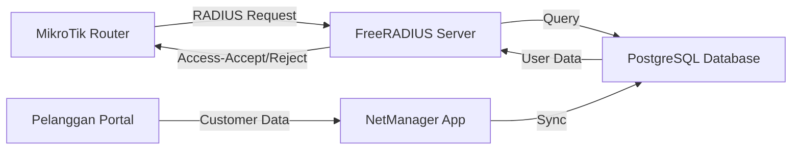

# FreeRADIUS Integration Guide

Complete guide for FreeRADIUS integration in NetManager - PPPoE authentication and accounting for ISP management.

## 🎯 Overview

NetManager integrates with FreeRADIUS to provide:
- **PPPoE Authentication**: Automatic customer authentication via RADIUS
- **Bandwidth Management**: Dynamic bandwidth limits based on package
- **Usage Tracking**: Real-time session monitoring and data usage accounting
- **Auto-Sync**: Customer data automatically syncs to RADIUS tables

## 🏗️ Architecture



### Components

1. **FreeRADIUS Server** - RADIUS authentication server (Docker container)
2. **PostgreSQL Database** - Shared database for NetManager and RADIUS
3. **MikroTik Router** - NAS device configured as RADIUS client
4. **NetManager API** - Sync service and management endpoints

## 📦 Installation

### 1. Start Services

```bash
# Start all services including FreeRADIUS
npm run db:up

# Verify containers are running
docker ps
```

Expected containers:
- `netmanager-postgres` (PostgreSQL)
- `netmanager-redis` (Redis)
- `netmanager-freeradius` (FreeRADIUS)

### 2. Database Setup

Database tables are already migrated via Prisma schema. Verify in Prisma Studio:

```bash
npx prisma studio
```

Check for these tables:
- `radcheck` - User authentication
- `radreply` - Reply attributes (bandwidth, etc)
- `radacct` - Accounting records
- `radgroupcheck` - Group policies
- `radgroupreply` - Group replies
- `radusergroup` - User-group mapping
- `radpostauth` - Auth logging

### 3. Configure MikroTik Router

Add RADIUS server in MikroTik:

```routeros
/radius
add address=<RADIUS_SERVER_IP> secret=<SECRET_FROM_DB> service=ppp

/ppp profile
set default use-radius=yes
```

**Note**: Use the `secretRadius` value from `MikroTikRouter` table in database.

### 4. Initial Sync

Sync all active customers to RADIUS:

```bash
curl -X POST http://localhost:3000/api/admin/radius/sync \
  -H "Cookie: <admin-session-cookie>"
```

## 🔌 API Endpoints

### Sync Operations

#### Sync All Customers
```http
POST /api/admin/radius/sync
Authorization: Admin session required

Response:
{
  "success": true,
  "message": "RADIUS sync completed",
  "stats": {
    "created": 10,
    "updated": 5,
    "deleted": 2,
    "total": 17
  }
}
```

#### Sync Single Customer
```http
POST /api/admin/radius/sync/[pelangganId]
Authorization: Admin session required

Response:
{
  "success": true,
  "message": "Customer synced to RADIUS",
  "data": {
    "synced": true,
    "username": "testuser001",
    "status": "AKTIF",
    "existsInRadius": true
  }
}
```

### Session Monitoring

#### Get Active Sessions
```http
GET /api/admin/radius/sessions
GET /api/admin/radius/sessions?username=testuser001
Authorization: Admin session required

Response:
{
  "success": true,
  "count": 5,
  "sessions": [
    {
      "radAcctId": "12345",
      "username": "testuser001",
      "acctSessionId": "abc123",
      "nasIpAddress": "192.168.1.1",
      "acctStartTime": "2024-01-15T10:00:00Z",
      "framedIpAddress": "10.10.1.100",
      "acctInputOctets": "1073741824",
      "acctOutputOctets": "536870912"
    }
  ]
}
```

### Accounting Statistics

#### Get Usage Stats
```http
GET /api/admin/radius/accounting/[username]
GET /api/admin/radius/accounting/testuser001?startDate=2024-01-01&endDate=2024-01-31
Authorization: Admin session required

Response:
{
  "success": true,
  "username": "testuser001",
  "period": {
    "startDate": "2024-01-01T00:00:00Z",
    "endDate": "2024-01-31T23:59:59Z"
  },
  "stats": {
    "totalSessions": 30,
    "totalSessionTime": "259200",
    "totalSessionTimeHours": 72,
    "totalInputOctets": "10737418240",
    "totalOutputOctets": "5368709120",
    "totalInputGB": 10,
    "totalOutputGB": 5,
    "activeSessions": 1
  }
}
```

## 🔄 Data Flow

### Customer Creation Flow

1. **Admin creates customer** in NetManager
   - Username: `testuser001`
   - Password: `testpass123`
   - Package: 10 Mbps
   - Status: AKTIF

2. **Trigger sync** (manual or automatic)
   ```bash
   POST /api/admin/radius/sync
   ```

3. **RADIUS entries created**:
   - `radcheck`: Authentication credentials
     ```
     username: testuser001
     attribute: Cleartext-Password
     value: testpass123
     ```
   - `radreply`: Bandwidth limit
     ```
     username: testuser001
     attribute: Mikrotik-Rate-Limit
     value: 10000000/10000000
     ```
   - `radusergroup`: Package group assignment

### Authentication Flow

1. **Customer connects via PPPoE**
   - Username: `testuser001`
   - Password: `testpass123`

2. **MikroTik sends RADIUS request** to FreeRADIUS

3. **FreeRADIUS queries PostgreSQL**
   - Check `radcheck` for credentials
   - Get `radreply` attributes
   - Check `radusergroup` membership

4. **Access-Accept response** with attributes:
   - Bandwidth limit
   - IP pool
   - DNS servers
   - Session timeout

5. **MikroTik applies settings** and grants access

### Accounting Flow

1. **Session start**: MikroTik sends Accounting-Start
   - Creates record in `radacct`
   - Records start time, NAS IP, session ID

2. **Interim updates**: Periodic updates during session
   - Updates usage data (input/output octets)
   - Updates session time

3. **Session stop**: Accounting-Stop packet
   - Records stop time
   - Final usage statistics

## 💡 Usage Examples

### Suspend Customer

When customer status changes to NONAKTIF:

```typescript
import { RadiusSyncService } from '@/lib/services/radius-sync-service';

const syncService = new RadiusSyncService(prisma);
await syncService.handleStatusChange(pelangganId, 'NONAKTIF');
```

This deletes the user from RADIUS, blocking authentication.

### Update Bandwidth

When customer changes package:

```typescript
await syncService.updateCustomerBandwidth(pelangganId);
```

This updates the `Mikrotik-Rate-Limit` attribute in `radreply`.

### Monitor Active Users

```typescript
const sessions = await syncService.getCustomerActiveSessions('testuser001');
console.log(`Active sessions: ${sessions.length}`);
```

## 🔧 Troubleshooting

### FreeRADIUS Container Not Running

```bash
# Check logs
docker logs netmanager-freeradius

# Restart container
docker restart netmanager-freeradius
```

### Authentication Failing

1. Check user exists in RADIUS:
   ```sql
   SELECT * FROM radcheck WHERE username = 'testuser001';
   ```

2. Verify MikroTik RADIUS config:
   ```routeros
   /radius print detail
   ```

3. Check FreeRADIUS logs:
   ```bash
   docker logs netmanager-freeradius -f
   ```

### Database Connection Issues

```bash
# Test PostgreSQL connection
docker exec -it netmanager-freeradius \
  psql postgresql://netmgr:netmgr@db:5432/netmanager
```

### Bandwidth Not Applied

1. Verify `radreply` entry:
   ```sql
   SELECT * FROM radreply WHERE username = 'testuser001' AND attribute = 'Mikrotik-Rate-Limit';
   ```

2. Check MikroTik queue:
   ```routeros
   /queue simple print
   ```

## 📊 Database Schema

### radcheck
| Column    | Type   | Description               |
|-----------|--------|---------------------------|
| id        | int    | Primary key               |
| username  | string | PPPoE username            |
| attribute | string | Check attribute name      |
| op        | string | Operator (==, :=, etc)    |
| value     | string | Attribute value           |

Common attributes:
- `Cleartext-Password` - User password
- `Expiration` - Account expiry date

### radreply
| Column    | Type   | Description               |
|-----------|--------|---------------------------|
| id        | int    | Primary key               |
| username  | string | PPPoE username            |
| attribute | string | Reply attribute name      |
| op        | string | Operator (=, :=, etc)     |
| value     | string | Attribute value           |

Common attributes:
- `Mikrotik-Rate-Limit` - Bandwidth (upload/download)
- `Framed-IP-Address` - Static IP
- `Session-Timeout` - Max session duration

### radacct
| Column            | Type     | Description                    |
|-------------------|----------|--------------------------------|
| radAcctId         | bigint   | Primary key                    |
| acctSessionId     | string   | Unique session ID              |
| username          | string   | User name                      |
| nasIpAddress      | string   | NAS IP address                 |
| acctStartTime     | datetime | Session start time             |
| acctStopTime      | datetime | Session stop time (if ended)   |
| acctSessionTime   | bigint   | Session duration (seconds)     |
| acctInputOctets   | bigint   | Downloaded bytes               |
| acctOutputOctets  | bigint   | Uploaded bytes                 |
| framedIpAddress   | string   | Assigned IP address            |

## 🚀 Next Steps (Phase 2+)

- [ ] Auto-sync on customer creation/update
- [ ] Dashboard UI for sessions and usage
- [ ] Quota-based plans with FUP
- [ ] Scheduled access (time-based packages)
- [ ] Dynamic VLAN assignment
- [ ] Email notifications for quota limits
- [ ] Usage reports and analytics

## 📚 References

- [FreeRADIUS Documentation](https://freeradius.org/documentation/)
- [MikroTik RADIUS Guide](https://wiki.mikrotik.com/wiki/Manual:RADIUS_Client)
- [RADIUS Protocol RFC 2865](https://datatracker.ietf.org/doc/html/rfc2865)
- [RADIUS Accounting RFC 2866](https://datatracker.ietf.org/doc/html/rfc2866)
