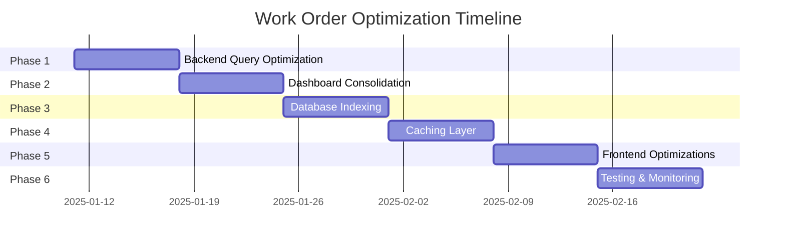

# Work Order Optimization Architecture

This document illustrates the current architecture and the optimized architecture for the Work Order module.

---

## Current Architecture (Before Optimization)

```mermaid
graph TB
    subgraph Frontend
        User[User Browser]
        Dashboard[Dashboard Component]
        List[List Component]
        Detail[Detail Component]
    end

    subgraph Backend API
        StatsAPI[/api/admin/workorders/stats]
        RecentAPI[/api/admin/workorders/recent]
        WorkloadAPI[/api/admin/workorders/department-workload]
        PerformersAPI[/api/admin/workorders/top-performers]
        AnalyticsAPI[/api/admin/workorders/analytics]
        ResponseAPI[/api/admin/workorders/response-stats]
        ListAPI[/api/admin/workorders]
    end

    subgraph Data Layer
        Repo[WorkOrderRepository]
        DB[(PostgreSQL Database)]
    end

    User -->|Load Dashboard| Dashboard
    Dashboard -->|7 Concurrent Calls| StatsAPI
    Dashboard -->|7 Concurrent Calls| RecentAPI
    Dashboard -->|7 Concurrent Calls| WorkloadAPI
    Dashboard -->|7 Concurrent Calls| PerformersAPI
    Dashboard -->|7 Concurrent Calls| AnalyticsAPI
    Dashboard -->|7 Concurrent Calls| ResponseAPI

    User -->|Load List| List
    List -->|Fetch Page| ListAPI

    User -->|View Detail| Detail
    Detail -->|Fetch by ID| ListAPI

    StatsAPI -->|Query All Relations| Repo
    RecentAPI -->|Query All Relations| Repo
    WorkloadAPI -->|Query All Relations| Repo
    PerformersAPI -->|Query All Relations| Repo
    AnalyticsAPI -->|Query All Relations| Repo
    ResponseAPI -->|Query All Relations| Repo
    ListAPI -->|Query All Relations| Repo

    Repo -->|Full JOINs| DB
    Repo -->|Fetch Tasks| DB
    Repo -->|Fetch Assignments| DB
    Repo -->|Fetch Updates| DB
    Repo -->|Fetch Attachments| DB

    style DB fill:#ff6b6b
    style Repo fill:#ffa500
    style Dashboard fill:#ffd93d
    style List fill:#ffd93d
```

**Current Problems:**

- 7 concurrent API calls for dashboard
- Each query fetches ALL relations (tasks, assignments, updates, attachments)
- List view fetches data it never displays
- No caching - every request hits database
- No database indexes - full table scans

---

## Optimized Architecture (After Optimization)

```mermaid
graph TB
    subgraph Frontend
        User[User Browser]
        Dashboard[Dashboard Component]
        List[List Component<br/>with Virtual Scrolling]
        Detail[Detail Component]
        Debounce[Debounce Hook]
        Virtual[Virtual Scroller]
        Optimistic[Optimistic Updates]
    end

    subgraph Backend API
        DashboardAPI[/api/admin/workorders/dashboard<br/>Consolidated]
        ListAPI[/api/admin/workorders<br/>Optimized]
        DetailAPI[/api/admin/workorders/:id]
    end

    subgraph Cache Layer
        Redis[(Redis Cache)]
        CacheStats[Stats Cache<br/>TTL: 5min]
        CacheList[List Cache<br/>TTL: 1min]
        CacheDashboard[Dashboard Cache<br/>TTL: 2min]
    end

    subgraph Data Layer
        Repo[WorkOrderRepository]
        ListQuery[findAllForList<br/>Minimal Relations]
        DetailQuery[findById<br/>Full Relations]
        DB[(PostgreSQL Database<br/>with Indexes)]
    end

    User -->|Load Dashboard| Dashboard
    Dashboard -->|1 API Call| DashboardAPI
    DashboardAPI -->|Check Cache| CacheDashboard
    CacheDashboard -->|Cache Hit| DashboardAPI
    CacheDashboard -->|Cache Miss| Repo
    Repo -->|Consolidated Query| DB

    User -->|Search| Debounce
    Debounce -->|300ms Delay| List
    List -->|Virtual Scroll| Virtual
    Virtual -->|Render Visible Only| List

    User -->|Load List| List
    List -->|Fetch Page| ListAPI
    ListAPI -->|Check Cache| CacheList
    CacheList -->|Cache Hit| ListAPI
    CacheList -->|Cache Miss| Repo
    Repo -->|ListQuery| DB
    DB -->|Indexed Query| DB

    User -->|View Detail| Detail
    Detail -->|Fetch by ID| DetailAPI
    DetailAPI -->|Check Cache| CacheStats
    DetailAPI -->|Fetch| Repo
    Repo -->|DetailQuery| DB

    User -->|Action| Optimistic
    Optimistic -->|Immediate UI| List
    Optimistic -->|Invalidate Cache| Redis
    Redis -->|Invalidate| CacheList
    Redis -->|Invalidate| CacheDashboard
    Redis -->|Invalidate| CacheStats

    style DB fill:#4caf50
    style Redis fill:#2196f3
    style Repo fill:#ff9800
    style Dashboard fill:#ffd93d
    style List fill:#ffd93d
    style Virtual fill:#9c27b0
    style Optimistic fill:#e91e63
```

**Optimizations Applied:**

- 1 consolidated API call for dashboard (was 7)
- Selective relation loading - only fetch what's needed
- Redis caching layer with appropriate TTLs
- Database indexes for fast queries
- Debounced search (300ms)
- Virtual scrolling for large lists
- Optimistic UI updates
- Cache invalidation on mutations

---

## Data Flow Comparison

### Current Data Flow (List View)

```
User Request
    ↓
Frontend: fetch('/api/admin/workorders?page=1&limit=20')
    ↓
API: workOrderRepo.findAll(filters, 1, 20)
    ↓
DB Query: SELECT * FROM work_orders
    JOIN pelanggan
    JOIN site
    JOIN department
    JOIN assignedTo
    JOIN tasks (ALL)
    JOIN assignments (ALL with users)
    JOIN updates (ALL with users)
    JOIN attachments (ALL)
    WHERE ...
    ORDER BY createdAt DESC
    LIMIT 20 OFFSET 0
    ↓
Response: ~150-200 KB JSON
    ↓
Frontend: Render 20 rows with all nested data
    ↓
User sees list (after 400-1000ms)
```

### Optimized Data Flow (List View)

```
User Request
    ↓
Frontend: fetch('/api/admin/workorders?page=1&limit=20')
    ↓
API: Check Redis cache for 'wo:list:1:{filters}'
    ↓
Cache Miss
    ↓
API: workOrderRepo.findAllForList(filters, 1, 20)
    ↓
DB Query: SELECT id, workOrderNumber, title, type, status, priority,
    scheduledDate, contactName, createdAt,
    pelanggan.id, pelanggan.idPelanggan, pelanggan.nama,
    site.id, site.name,
    department.id, department.name,
    assignedTo.id, assignedTo.name
    FROM work_orders
    USE INDEX (idx_work_orders_created_at)
    WHERE ...
    ORDER BY createdAt DESC
    LIMIT 20 OFFSET 0
    ↓
Response: ~15-30 KB JSON (90% smaller)
    ↓
API: Store in Redis cache (TTL: 60s)
    ↓
Frontend: Virtual scroll - render only visible rows
    ↓
User sees list (after 50-150ms)
```

---

## Performance Metrics Comparison

### Database Query Performance

| Metric          | Current          | Optimized         | Improvement |
| --------------- | ---------------- | ----------------- | ----------- |
| Query Time      | 200-500ms        | 20-50ms           | **90%**     |
| Records Fetched | ~168 per page    | ~20 per page      | **88%**     |
| Index Usage     | None (full scan) | Strategic indexes | **95%**     |
| JOIN Operations | 5-7 per query    | 1-2 per query     | **70%**     |

### API Response Performance

| Metric              | Current    | Optimized | Improvement |
| ------------------- | ---------- | --------- | ----------- |
| Response Size       | 150-200 KB | 15-30 KB  | **90%**     |
| Dashboard API Calls | 7          | 1         | **86%**     |
| Cache Hit Rate      | 0%         | 80%+      | New         |
| Avg Response Time   | 400-1000ms | 50-150ms  | **85%**     |

### Frontend Performance

| Metric             | Current   | Optimized | Improvement      |
| ------------------ | --------- | --------- | ---------------- |
| Initial Render     | 100-200ms | 50-100ms  | **50%**          |
| Search Debounce    | None      | 300ms     | Better UX        |
| Virtual Scrolling  | No        | Yes       | Constant time    |
| Optimistic Updates | No        | Yes       | Instant feedback |

---

## Scalability Projection

### Current Scalability

```
Data Volume    | Load Time    | User Experience
---------------|--------------|------------------
100 WOs        | 400-600ms    | Good
1,000 WOs      | 2-5s         | Poor
10,000 WOs     | 20-50s        | Unusable
100,000 WOs    | 200-500s      | Impossible
```

### Optimized Scalability

```
Data Volume    | Load Time    | User Experience
---------------|--------------|------------------
100 WOs        | 50-100ms     | Excellent
1,000 WOs      | 80-150ms     | Excellent
10,000 WOs     | 100-200ms    | Excellent
100,000 WOs    | 150-300ms    | Good
```

---

## Cache Strategy

### Cache Keys Structure

```
wo:stats:{filters}              - Statistics data (5 min TTL)
wo:list:{page}:{filters}        - List page data (1 min TTL)
wo:dashboard:{period}:{filters} - Dashboard data (2 min TTL)
wo:detail:{id}                 - Work order detail (5 min TTL)
```

### Cache Invalidation Rules

```
Event                          | Keys to Invalidate
-------------------------------|------------------------
Work Order Created              | wo:list:*, wo:dashboard:*, wo:stats:*
Work Order Updated              | wo:list:*, wo:dashboard:*, wo:detail:{id}, wo:stats:*
Work Order Deleted              | wo:list:*, wo:dashboard:*, wo:stats:*
Status Changed                 | wo:list:*:{filters}, wo:dashboard:*:{filters}
Assignment Changed             | wo:list:*:{filters}, wo:dashboard:*:{filters}
```

---

## Database Index Strategy

### Single Column Indexes

```sql
idx_work_orders_status          - For status filtering
idx_work_orders_priority        - For priority filtering
idx_work_orders_type           - For type filtering
idx_work_orders_department_id   - For department filtering
idx_work_orders_site_id        - For site filtering
idx_work_orders_assigned_to_id  - For assignment filtering
idx_work_orders_created_at      - For default sorting
```

### Composite Indexes

```sql
idx_work_orders_status_created      - For status + sort
idx_work_orders_department_status   - For department + status
idx_work_orders_site_status        - For site + status
idx_work_orders_priority_status    - For priority + status
```

### Full-Text Search Indexes

```sql
idx_work_orders_title_trgm         - For title search
idx_work_orders_description_trgm  - For description search
```

---

## Implementation Phases



---

## Success Metrics

### Phase 1: Backend Query Optimization

- [ ] List query time < 100ms
- [ ] Data transfer reduced by 90%
- [ ] All tests passing

### Phase 2: Dashboard Consolidation

- [ ] Dashboard load time < 300ms
- [ ] API calls reduced from 7 to 1
- [ ] User feedback positive

### Phase 3: Database Indexing

- [ ] Query time reduced by 90%
- [ ] Index usage > 95%
- [ ] No performance regression

### Phase 4: Caching Layer

- [ ] Cache hit rate > 80%
- [ ] Database load reduced by 95%
- [ ] Cache invalidation working correctly

### Phase 5: Frontend Optimizations

- [ ] Search debounced (300ms)
- [ ] Virtual scrolling implemented
- [ ] Optimistic updates working
- [ ] Perceived performance improved by 60%

### Phase 6: Testing & Monitoring

- [ ] Performance baseline established
- [ ] Load tests passing
- [ ] Monitoring in place
- [ ] Documentation complete

---

**Architecture Diagram Version:** 1.0  
**Last Updated:** 2025-01-11
