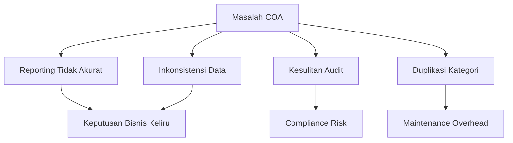
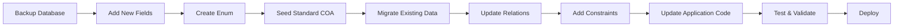
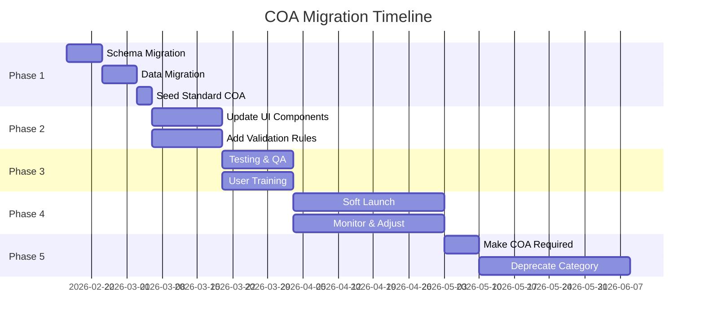

# Arsitektur Perbaikan Sistem Chart of Accounts (COA)

**Versi:** 1.0  
**Tanggal:** 17 Februari 2026  
**Status:** Draft

---

## Daftar Isi

- [1. Executive Summary](#1-executive-summary)
- [2. Masalah yang Ditemukan](#2-masalah-yang-ditemukan)
- [3. Desain Database Schema Baru](#3-desain-database-schema-baru)
- [4. Struktur COA Standar Indonesia](#4-struktur-coa-standar-indonesia)
- [5. Validasi Rules](#5-validasi-rules)
- [6. Migration Strategy](#6-migration-strategy)
- [7. Rekomendasi Perubahan pada Relasi](#7-rekomendasi-perubahan-pada-relasi)
- [8. Implementation Roadmap](#8-implementation-roadmap)

---

## 1. Executive Summary

Dokumen ini merancang arsitektur perbaikan sistem Chart of Accounts (COA) untuk aplikasi netmanager yang bertujuan mengatasi 8 masalah utama yang ditemukan dalam analisis sebelumnya. Perbaikan ini mencakup:

- Standarisasi struktur COA mengikuti standar akuntansi Indonesia
- Implementasi validasi type matching dan hierarki
- Penambahan enum untuk SubType yang ter-standarisasi
- Sistem penomoran 4 digit dengan prefix berdasarkan type
- Peningkatan UI dengan informasi hierarki yang lebih jelas
- Strategi migrasi data yang aman

---

## 2. Masalah yang Ditemukan

### 2.1. Daftar Masalah Existing

1. **COA bersifat optional** - Field `coaId` di Transaction, Expense, dan RabItem tidak wajib
2. **Tidak ada validasi type matching** - Tidak ada constraint antara transaction type dan COA type
3. **Hierarki COA tidak dimanfaatkan** - Parent-child relationship tidak divalidasi
4. **SubType tidak ter-standarisasi** - Field `subType` adalah free text
5. **Tidak ada standar penomoran kode akun** - Format kode tidak konsisten
6. **UI COASelect kurang informatif** - Tidak menampilkan hierarki atau subtype
7. **Tidak ada validasi parent-child** - Parent dan child bisa berbeda type
8. **Duplikasi dengan TransactionCategory** - Ada overlap fungsi antara COA dan TransactionCategory

### 2.2. Impact Analysis



---

## 3. Desain Database Schema Baru

### 3.1. Enum Definitions

#### COAType (existing, keep as string for flexibility)
```prisma
// Di aplikasi level, enforce via validation
enum COAType {
  ASSET
  LIABILITY  
  EQUITY
  REVENUE
  EXPENSE
}
```

#### COASubType (NEW)
```prisma
enum COASubType {
  // ASSET Subtypes
  CURRENT_ASSET
  FIXED_ASSET
  OTHER_ASSET
  
  // LIABILITY Subtypes
  CURRENT_LIABILITY
  LONG_TERM_LIABILITY
  OTHER_LIABILITY
  
  // EQUITY Subtypes
  CAPITAL
  RETAINED_EARNINGS
  DRAWING
  
  // REVENUE Subtypes
  OPERATING_REVENUE
  NON_OPERATING_REVENUE
  
  // EXPENSE Subtypes
  OPEX
  CAPEX
  COGS
  OTHER_EXPENSE
}
```

### 3.2. Updated ChartOfAccount Model

```prisma
model ChartOfAccount {
  id            String      @id @default(cuid())
  code          String      @unique
  name          String
  type          String      // ASSET, LIABILITY, EQUITY, REVENUE, EXPENSE
  subType       COASubType? // Enum instead of free text
  normalBalance String      // DEBIT, CREDIT
  
  // NEW FIELDS
  level         Int         @default(1)        // Hierarki level (1-4)
  isHeader      Boolean     @default(false)    // Header account (group only)
  allowPosting  Boolean     @default(true)     // Allow transactions (false for headers)
  
  // Hierarki
  parentId      String?
  parent        ChartOfAccount?  @relation("AccountHierarchy", fields: [parentId], references: [id])
  children      ChartOfAccount[] @relation("AccountHierarchy")
  
  description   String?
  isActive      Boolean     @default(true)
  isSystem      Boolean     @default(false)    // System account, cannot be deleted
  
  // Relations
  transactions      Transaction[]
  expenses          Expense[]
  rabItems          RabItem[]
  financialAccounts FinancialAccount[]
  
  createdAt     DateTime @default(now())
  updatedAt     DateTime @updatedAt
  
  @@index([code])
  @@index([type])
  @@index([level])
  @@index([parentId])
  @@index([isActive])
  @@index([allowPosting])
}
```

### 3.3. Constraints & Business Rules

#### Database Constraints
```sql
-- Constraint 1: Code format validation (4 digits)
-- Implemented via application validation

-- Constraint 2: Code prefix must match type
-- 1xxx = ASSET
-- 2xxx = LIABILITY  
-- 3xxx = EQUITY
-- 4xxx = REVENUE
-- 5xxx = EXPENSE

-- Constraint 3: Max 4 levels deep
-- Level 1: 1000
-- Level 2: 1100
-- Level 3: 1110
-- Level 4: 1111

-- Constraint 4: Header accounts cannot allow posting
-- If isHeader = true, then allowPosting = false

-- Constraint 5: Leaf accounts must allow posting
-- If no children, then allowPosting should be true
```

#### Validation Rules in Code
```typescript
// Code Format Validation
const validateCOACode = (code: string, type: string): boolean => {
  const prefix = code.charAt(0);
  const typePrefix: Record<string, string> = {
    'ASSET': '1',
    'LIABILITY': '2',
    'EQUITY': '3',
    'REVENUE': '4',
    'EXPENSE': '5'
  };
  
  return code.length === 4 && 
         prefix === typePrefix[type] &&
         /^\d{4}$/.test(code);
}

// Level Calculation
const calculateLevel = (code: string): number => {
  if (code.endsWith('000')) return 1;      // 1000
  if (code.endsWith('00')) return 2;       // 1100
  if (code.charAt(3) === '0') return 3;    // 1110
  return 4;                                // 1111
}
```

---

## 4. Struktur COA Standar Indonesia

### 4.1. ASET (1000-1999)

#### 4.1.1. Aset Lancar (1100-1199)

```
1000 - ASET (Header)
  1100 - ASET LANCAR (Header)
    1110 - Kas dan Bank (Header)
      1111 - Kas
      1112 - Bank Mandiri
      1113 - Bank BCA
      1114 - Bank BNI
      1115 - Bank BRI
    1120 - Piutang (Header)
      1121 - Piutang Usaha
      1122 - Piutang Karyawan
      1123 - Piutang Lain-lain
      1124 - Cadangan Kerugian Piutang
    1130 - Persediaan (Header)
      1131 - Persediaan Barang Dagang
      1132 - Persediaan Material
      1133 - Persediaan Spare Part
    1140 - Biaya Dibayar Dimuka (Header)
      1141 - Sewa Dibayar Dimuka
      1142 - Asuransi Dibayar Dimuka
      1143 - Biaya Dibayar Dimuka Lainnya
```

#### 4.1.2. Aset Tetap (1200-1299)

```
  1200 - ASET TETAP (Header)
    1210 - Peralatan dan Mesin (Header)
      1211 - Router dan Switch
      1212 - OLT/ONU Equipment
      1213 - Server dan Storage
      1214 - Computer dan Laptop
      1215 - Akumulasi Penyusutan Peralatan
    1220 - Infrastruktur Jaringan (Header)
      1221 - Fiber Optic Cable
      1222 - ODP/ODC/OTB
      1223 - Tower dan Pole
      1224 - Duct dan Conduit
      1225 - Akumulasi Penyusutan Infrastruktur
    1230 - Kendaraan (Header)
      1231 - Kendaraan Operasional
      1232 - Akumulasi Penyusutan Kendaraan
    1240 - Gedung dan Bangunan (Header)
      1241 - Gedung Kantor
      1242 - Bangunan POP
      1243 - Akumulasi Penyusutan Gedung
    1250 - Tanah
```

#### 4.1.3. Aset Lainnya (1900-1999)

```
  1900 - ASET LAINNYA (Header)
    1910 - Investasi Jangka Panjang
    1920 - Aset Tidak Berwujud (Header)
      1921 - Software dan License
      1922 - Goodwill
      1923 - Hak Sewa
```

### 4.2. KEWAJIBAN (2000-2999)

#### 4.2.1. Kewajiban Lancar (2100-2199)

```
2000 - KEWAJIBAN (Header)
  2100 - KEWAJIBAN LANCAR (Header)
    2110 - Hutang Usaha (Header)
      2111 - Hutang Supplier
      2112 - Hutang Vendor
      2113 - Hutang Lain-lain
    2120 - Hutang Pajak (Header)
      2121 - Hutang PPh 21
      2122 - Hutang PPh 23
      2123 - Hutang PPN
    2130 - Biaya yang Masih Harus Dibayar (Header)
      2131 - Gaji yang Masih Harus Dibayar
      2132 - Listrik yang Masih Harus Dibayar
      2133 - Biaya Lain yang Masih Harus Dibayar
    2140 - Pendapatan Diterima Dimuka (Header)
      2141 - Pendapatan Langganan Diterima Dimuka
      2142 - Deposit Pelanggan
```

#### 4.2.2. Kewajiban Jangka Panjang (2200-2299)

```
  2200 - KEWAJIBAN JANGKA PANJANG (Header)
    2210 - Hutang Bank (Header)
      2211 - Kredit Modal Kerja
      2212 - Kredit Investasi
    2220 - Hutang Obligasi
    2230 - Hutang Sewa Pembiayaan
```

### 4.3. EKUITAS (3000-3999)

```
3000 - EKUITAS (Header)
  3100 - MODAL (Header)
    3110 - Modal Pemilik
    3111 - Modal Saham
    3112 - Agio Saham
  3200 - LABA DITAHAN (Header)
    3210 - Laba Ditahan Tahun Berjalan
    3211 - Laba Ditahan Tahun Lalu
  3300 - PRIVE/DIVIDEN (Header)
    3310 - Prive Pemilik
    3311 - Dividen
```

### 4.4. PENDAPATAN (4000-4999)

#### 4.4.1. Pendapatan Usaha (4100-4199)

```
4000 - PENDAPATAN (Header)
  4100 - PENDAPATAN USAHA (Header)
    4110 - Pendapatan Layanan Internet (Header)
      4111 - Pendapatan Langganan Bulanan
      4112 - Pendapatan Biaya Instalasi
      4113 - Pendapatan Biaya Reconnect
      4114 - Pendapatan Upgrade Paket
    4120 - Pendapatan Layanan Lainnya (Header)
      4121 - Pendapatan Maintenance
      4122 - Pendapatan Konsultasi
      4123 - Pendapatan Sewa Perangkat
```

#### 4.4.2. Pendapatan Lain-lain (4900-4999)

```
  4900 - PENDAPATAN LAIN-LAIN (Header)
    4910 - Pendapatan Bunga
    4920 - Pendapatan Denda
    4930 - Laba Penjualan Aset
    4940 - Pendapatan Lain-lain
```

### 4.5. BEBAN/BIAYA (5000-5999)

#### 4.5.1. COGS - Cost of Goods Sold (5100-5199)

```
5000 - BEBAN (Header)
  5100 - HARGA POKOK PENJUALAN (Header)
    5110 - HPP Material dan Instalasi (Header)
      5111 - HPP Material Instalasi
      5112 - HPP Tenaga Kerja Instalasi
      5113 - HPP Equipment Pelanggan
```

#### 4.5.2. OPEX - Operating Expenses (5200-5599)

```
  5200 - BEBAN OPERASIONAL (Header)
    5210 - Beban Gaji dan Tunjangan (Header)
      5211 - Gaji Karyawan
      5212 - Tunjangan Karyawan
      5213 - Bonus dan Insentif
      5214 - BPJS Kesehatan
      5215 - BPJS Ketenagakerjaan
      5216 - Lembur
    5220 - Beban Bandwidth dan Koneksi (Header)
      5221 - Beban Bandwidth Upstream
      5222 - Beban Internet Exchange (IIX)
      5223 - Beban Koneksi Internasional
    5230 - Beban Operasional Kantor (Header)
      5231 - Beban Sewa Kantor
      5232 - Beban Listrik
      5233 - Beban Air
      5234 - Beban Telepon
      5235 - Beban Alat Tulis Kantor
      5236 - Beban Konsumsi
    5240 - Beban Pemeliharaan (Header)
      5241 - Beban Pemeliharaan Peralatan
      5242 - Beban Pemeliharaan Infrastruktur
      5243 - Beban Pemeliharaan Kendaraan
      5244 - Beban Pemeliharaan Gedung
    5250 - Beban Administrasi dan Umum (Header)
      5251 - Beban Bank
      5252 - Beban Administrasi
      5253 - Beban Perizinan
      5254 - Beban Asuransi
      5255 - Beban Profesional Fee
    5260 - Beban Pemasaran (Header)
      5261 - Beban Iklan
      5262 - Beban Promosi
      5263 - Beban Komisi Sales
      5264 - Beban Event dan Sponsorship
    5270 - Beban Transportasi (Header)
      5271 - Beban Bensin dan Solar
      5272 - Beban Parkir dan Tol
      5273 - Beban Transport Karyawan
    5280 - Beban Penyusutan (Header)
      5281 - Beban Penyusutan Peralatan
      5282 - Beban Penyusutan Infrastruktur
      5283 - Beban Penyusutan Kendaraan
      5284 - Beban Penyusutan Gedung
```

#### 4.5.3. CAPEX - Capital Expenditure (5600-5699)

```
  5600 - BELANJA MODAL (Header)
    5610 - Belanja Peralatan Network (Header)
      5611 - Belanja Router dan Switch
      5612 - Belanja OLT/ONU
      5613 - Belanja Server
    5620 - Belanja Infrastruktur (Header)
      5621 - Belanja Fiber Optic
      5622 - Belanja ODP/ODC/OTB
      5623 - Belanja Tower/Pole
    5630 - Belanja Kendaraan
    5640 - Belanja Gedung dan Tanah
```

#### 4.5.4. Beban Lain-lain (5900-5999)

```
  5900 - BEBAN LAIN-LAIN (Header)
    5910 - Beban Bunga
    5920 - Beban Denda dan Penalty
    5930 - Rugi Penjualan Aset
    5940 - Beban Pajak
    5950 - Beban Lain-lain
```

---

## 5. Validasi Rules

### 5.1. Type Matching Validation

#### 5.1.1. Transaction to COA Type Matching

```typescript
interface TypeMatchingRule {
  transactionType: 'INCOME' | 'EXPENSE';
  allowedCOATypes: string[];
  recommendedCOATypes: string[];
}

const TYPE_MATCHING_RULES: TypeMatchingRule[] = [
  {
    transactionType: 'INCOME',
    allowedCOATypes: ['REVENUE', 'LIABILITY', 'EQUITY'],
    recommendedCOATypes: ['REVENUE']
  },
  {
    transactionType: 'EXPENSE',
    allowedCOATypes: ['EXPENSE', 'ASSET'],
    recommendedCOATypes: ['EXPENSE']
  }
];

// Validation Function
const validateTransactionCOA = (
  transactionType: string, 
  coaType: string
): { valid: boolean; warning?: string } => {
  const rule = TYPE_MATCHING_RULES.find(r => r.transactionType === transactionType);
  
  if (!rule) {
    return { valid: false };
  }
  
  if (!rule.allowedCOATypes.includes(coaType)) {
    return { 
      valid: false 
    };
  }
  
  if (!rule.recommendedCOATypes.includes(coaType)) {
    return { 
      valid: true, 
      warning: `Type ${coaType} tidak direkomendasikan untuk transaksi ${transactionType}` 
    };
  }
  
  return { valid: true };
};
```

### 5.2. Hierarki Validation

#### 5.2.1. Parent-Child Type Consistency

```typescript
const validateParentChild = (
  parentCOA: ChartOfAccount, 
  childCOA: Partial<ChartOfAccount>
): ValidationResult => {
  // Rule 1: Parent dan child harus memiliki type yang sama
  if (parentCOA.type !== childCOA.type) {
    return {
      valid: false,
      errors: ['Parent dan child harus memiliki type yang sama']
    };
  }
  
  // Rule 2: Child level harus lebih besar dari parent level
  if (childCOA.level && childCOA.level <= parentCOA.level) {
    return {
      valid: false,
      errors: ['Level child harus lebih besar dari parent']
    };
  }
  
  // Rule 3: Max 4 levels
  if (childCOA.level && childCOA.level > 4) {
    return {
      valid: false,
      errors: ['Maksimal 4 level hierarki']
    };
  }
  
  // Rule 4: Code prefix harus match dengan parent
  const parentPrefix = parentCOA.code.substring(0, parentCOA.level);
  const childPrefix = childCOA.code?.substring(0, parentCOA.level);
  
  if (childPrefix !== parentPrefix) {
    return {
      valid: false,
      errors: ['Kode child harus dimulai dengan prefix parent']
    };
  }
  
  return { valid: true };
};
```

#### 5.2.2. Level Calculation and Validation

```typescript
const calculateAndValidateLevel = (code: string): number => {
  // Format: XXXX
  // Level 1: X000 (e.g., 1000, 2000)
  // Level 2: XX00 (e.g., 1100, 2100)
  // Level 3: XXX0 (e.g., 1110, 2110)
  // Level 4: XXXX (e.g., 1111, 2111)
  
  if (code.endsWith('000')) return 1;
  if (code.endsWith('00')) return 2;
  if (code.endsWith('0')) return 3;
  return 4;
};
```

### 5.3. Posting Validation

```typescript
const validatePosting = (coa: ChartOfAccount): ValidationResult => {
  // Rule 1: Header account (isHeader = true) tidak boleh allow posting
  if (coa.isHeader && coa.allowPosting) {
    return {
      valid: false,
      errors: ['Header account tidak boleh menerima posting']
    };
  }
  
  // Rule 2: Account dengan children tidak boleh allow posting
  if (coa.children && coa.children.length > 0 && coa.allowPosting) {
    return {
      valid: false,
      errors: ['Account dengan sub-account tidak boleh menerima posting']
    };
  }
  
  // Rule 3: Leaf account (tidak punya children) harus allow posting
  if ((!coa.children || coa.children.length === 0) && !coa.allowPosting && !coa.isHeader) {
    return {
      valid: false,
      errors: ['Leaf account harus allow posting']
    };
  }
  
  return { valid: true };
};
```

### 5.4. Code Format Validation

```typescript
interface CodeValidation {
  format: RegExp;
  typePrefix: Record<string, string>;
  levelRules: {
    level: number;
    pattern: RegExp;
    example: string;
  }[];
}

const CODE_VALIDATION: CodeValidation = {
  format: /^\d{4}$/,
  typePrefix: {
    'ASSET': '1',
    'LIABILITY': '2',
    'EQUITY': '3',
    'REVENUE': '4',
    'EXPENSE': '5'
  },
  levelRules: [
    { level: 1, pattern: /^\d000$/, example: '1000' },
    { level: 2, pattern: /^\d\d00$/, example: '1100' },
    { level: 3, pattern: /^\d\d\d0$/, example: '1110' },
    { level: 4, pattern: /^\d{4}$/, example: '1111' }
  ]
};

const validateCOACode = (
  code: string, 
  type: string, 
  level: number
): ValidationResult => {
  const errors: string[] = [];
  
  // Validate format (4 digits)
  if (!CODE_VALIDATION.format.test(code)) {
    errors.push('Kode harus 4 digit angka');
  }
  
  // Validate prefix matches type
  const expectedPrefix = CODE_VALIDATION.typePrefix[type];
  if (code.charAt(0) !== expectedPrefix) {
    errors.push(`Kode ${type} harus dimulai dengan ${expectedPrefix}`);
  }
  
  // Validate level pattern
  const levelRule = CODE_VALIDATION.levelRules.find(r => r.level === level);
  if (levelRule && !levelRule.pattern.test(code)) {
    errors.push(`Format kode level ${level} harus seperti ${levelRule.example}`);
  }
  
  return {
    valid: errors.length === 0,
    errors
  };
};
```

### 5.5. Deletion Validation

```typescript
const validateDeletion = async (coaId: string): Promise<ValidationResult> => {
  const coa = await prisma.chartOfAccount.findUnique({
    where: { id: coaId },
    include: {
      children: true,
      transactions: true,
      expenses: true,
      rabItems: true,
      financialAccounts: true
    }
  });
  
  if (!coa) {
    return { valid: false, errors: ['COA tidak ditemukan'] };
  }
  
  const errors: string[] = [];
  
  // Rule 1: System account tidak boleh dihapus
  if (coa.isSystem) {
    errors.push('System account tidak boleh dihapus');
  }
  
  // Rule 2: Account dengan children tidak boleh dihapus
  if (coa.children.length > 0) {
    errors.push('Account dengan sub-account tidak boleh dihapus. Hapus sub-account terlebih dahulu.');
  }
  
  // Rule 3: Account dengan transaksi tidak boleh dihapus, hanya di-nonaktifkan
  const hasTransactions = 
    coa.transactions.length > 0 ||
    coa.expenses.length > 0 ||
    coa.rabItems.length > 0 ||
    coa.financialAccounts.length > 0;
    
  if (hasTransactions) {
    errors.push('Account dengan transaksi tidak boleh dihapus. Gunakan fitur non-aktifkan.');
  }
  
  return {
    valid: errors.length === 0,
    errors
  };
};
```

---

## 6. Migration Strategy

### 6.1. Migration Steps Overview



### 6.2. Detailed Migration Plan

#### Phase 1: Schema Migration (Non-Breaking)

```prisma
// Step 1: Add new fields as optional
model ChartOfAccount {
  // ... existing fields
  
  level         Int?        // Make optional first
  isHeader      Boolean?    @default(false)
  allowPosting  Boolean?    @default(true)
  isSystem      Boolean?    @default(false)
}

// Step 2: Create enum
enum COASubType {
  CURRENT_ASSET
  FIXED_ASSET
  // ... (as defined in section 3.1)
}

// Step 3: Update subType to use enum (nullable for migration)
model ChartOfAccount {
  subType       COASubType? // Changed from String? to COASubType?
}
```

**Migration SQL:**
```sql
-- Add new columns
ALTER TABLE "ChartOfAccount" ADD COLUMN "level" INTEGER;
ALTER TABLE "ChartOfAccount" ADD COLUMN "isHeader" BOOLEAN DEFAULT false;
ALTER TABLE "ChartOfAccount" ADD COLUMN "allowPosting" BOOLEAN DEFAULT true;
ALTER TABLE "ChartOfAccount" ADD COLUMN "isSystem" BOOLEAN DEFAULT false;

-- Create enum type
CREATE TYPE "COASubType" AS ENUM (
  'CURRENT_ASSET',
  'FIXED_ASSET',
  'OTHER_ASSET',
  'CURRENT_LIABILITY',
  'LONG_TERM_LIABILITY',
  'OTHER_LIABILITY',
  'CAPITAL',
  'RETAINED_EARNINGS',
  'DRAWING',
  'OPERATING_REVENUE',
  'NON_OPERATING_REVENUE',
  'OPEX',
  'CAPEX',
  'COGS',
  'OTHER_EXPENSE'
);
```

#### Phase 2: Data Migration

```typescript
// migration-script.ts
async function migrateExistingCOA() {
  const allAccounts = await prisma.chartOfAccount.findMany();
  
  for (const account of allAccounts) {
    // Calculate level from code
    const level = calculateAndValidateLevel(account.code);
    
    // Determine if header (has children or level < 4)
    const childrenCount = await prisma.chartOfAccount.count({
      where: { parentId: account.id }
    });
    const isHeader = childrenCount > 0 || level < 4;
    
    // Set allowPosting (inverse of isHeader)
    const allowPosting = !isHeader;
    
    // Map old subType string to new enum
    const newSubType = mapSubTypeToEnum(account.subType, account.type);
    
    // Update account
    await prisma.chartOfAccount.update({
      where: { id: account.id },
      data: {
        level,
        isHeader,
        allowPosting,
        subType: newSubType,
        isSystem: false // All existing accounts are not system accounts
      }
    });
  }
}

function mapSubTypeToEnum(
  oldSubType: string | null, 
  type: string
): COASubType | null {
  if (!oldSubType) return null;
  
  const mapping: Record<string, COASubType> = {
    // ASSET mappings
    'CURRENT_ASSET': 'CURRENT_ASSET',
    'FIXED_ASSET': 'FIXED_ASSET',
    'Aset Lancar': 'CURRENT_ASSET',
    'Aset Tetap': 'FIXED_ASSET',
    
    // LIABILITY mappings
    'CURRENT_LIABILITY': 'CURRENT_LIABILITY',
    'LONG_TERM_LIABILITY': 'LONG_TERM_LIABILITY',
    'Hutang Lancar': 'CURRENT_LIABILITY',
    'Hutang Jangka Panjang': 'LONG_TERM_LIABILITY',
    
    // EXPENSE mappings
    'OPEX': 'OPEX',
    'CAPEX': 'CAPEX',
    'COGS': 'COGS',
    'Operational': 'OPEX',
    'Capital': 'CAPEX',
    
    // Add more mappings as needed
  };
  
  return mapping[oldSubType] || null;
}
```

#### Phase 3: Seed Standard COA

```typescript
// seed-standard-coa.ts
async function seedStandardCOA() {
  // Delete existing COA if starting fresh (optional, be careful!)
  // await prisma.chartOfAccount.deleteMany();
  
  // Seed according to structure in section 4
  const standardCOA = [
    // Level 1: Main Categories
    {
      code: '1000',
      name: 'ASET',
      type: 'ASSET',
      subType: null,
      level: 1,
      isHeader: true,
      allowPosting: false,
      isSystem: true,
      normalBalance: 'DEBIT'
    },
    {
      code: '2000',
      name: 'KEWAJIBAN',
      type: 'LIABILITY',
      subType: null,
      level: 1,
      isHeader: true,
      allowPosting: false,
      isSystem: true,
      normalBalance: 'CREDIT'
    },
    // ... continue with all accounts from section 4
  ];
  
  // Create accounts hierarchically
  for (const account of standardCOA) {
    // Find parent if exists
    let parentId = null;
    if (account.level > 1) {
      const parentCode = getParentCode(account.code, account.level);
      const parent = await prisma.chartOfAccount.findUnique({
        where: { code: parentCode }
      });
      parentId = parent?.id || null;
    }
    
    await prisma.chartOfAccount.upsert({
      where: { code: account.code },
      update: account,
      create: {
        ...account,
        parentId
      }
    });
  }
}

function getParentCode(code: string, level: number): string {
  if (level === 2) return code.substring(0, 1) + '000';
  if (level === 3) return code.substring(0, 2) + '00';
  if (level === 4) return code.substring(0, 3) + '0';
  return code;
}
```

#### Phase 4: Handle Null COA IDs in Transactions

```typescript
// Strategy 1: Create default "Uncategorized" accounts
async function createDefaultAccounts() {
  const defaults = [
    {
      code: '4999',
      name: 'Pendapatan Belum Terkategorisasi',
      type: 'REVENUE',
      subType: 'NON_OPERATING_REVENUE',
      level: 4,
      allowPosting: true,
      isSystem: true,
      normalBalance: 'CREDIT'
    },
    {
      code: '5999',
      name: 'Beban Belum Terkategorisasi',
      type: 'EXPENSE',
      subType: 'OTHER_EXPENSE',
      level: 4,
      allowPosting: true,
      isSystem: true,
      normalBalance: 'DEBIT'
    }
  ];
  
  for (const account of defaults) {
    await prisma.chartOfAccount.create({ data: account });
  }
}

// Strategy 2: Migrate transactions with null coaId
async function migrateNullCOATransactions() {
  const defaultRevenue = await prisma.chartOfAccount.findUnique({
    where: { code: '4999' }
  });
  const defaultExpense = await prisma.chartOfAccount.findUnique({
    where: { code: '5999' }
  });
  
  // Update Transactions
  await prisma.transaction.updateMany({
    where: { 
      coaId: null,
      type: 'INCOME'
    },
    data: { coaId: defaultRevenue?.id }
  });
  
  await prisma.transaction.updateMany({
    where: { 
      coaId: null,
      type: 'EXPENSE'
    },
    data: { coaId: defaultExpense?.id }
  });
  
  // Update Expenses
  await prisma.expense.updateMany({
    where: { coaId: null },
    data: { coaId: defaultExpense?.id }
  });
  
  // Update RabItems
  await prisma.rabItem.updateMany({
    where: { coaId: null },
    data: { coaId: defaultExpense?.id }
  });
}
```

#### Phase 5: TransactionCategory to COA Mapping

```typescript
// Create mapping table
interface CategoryCOAMapping {
  categoryId: string;
  categoryName: string;
  categoryType: 'INCOME' | 'EXPENSE';
  expenseType?: 'OPERATIONAL' | 'CAPITAL';
  recommendedCOACode: string;
}

const categoryMappings: CategoryCOAMapping[] = [
  {
    categoryId: 'xxx',
    categoryName: 'Pendapatan Langganan',
    categoryType: 'INCOME',
    recommendedCOACode: '4111'
  },
  {
    categoryId: 'yyy',
    categoryName: 'Biaya Bandwidth',
    categoryType: 'EXPENSE',
    expenseType: 'OPERATIONAL',
    recommendedCOACode: '5221'
  },
  // ... more mappings
];

async function applyTransactionCategoryMapping() {
  for (const mapping of categoryMappings) {
    const coa = await prisma.chartOfAccount.findUnique({
      where: { code: mapping.recommendedCOACode }
    });
    
    if (!coa) continue;
    
    // Update all transactions using this category
    await prisma.transaction.updateMany({
      where: { categoryId: mapping.categoryId },
      data: { coaId: coa.id }
    });
  }
}
```

### 6.3. Rollback Plan

```typescript
// rollback-migration.ts
async function rollbackCOAMigration() {
  console.log('Starting rollback...');
  
  // Step 1: Remove constraints
  await prisma.$executeRaw`
    ALTER TABLE "ChartOfAccount" 
    ALTER COLUMN "level" DROP NOT NULL;
  `;
  
  // Step 2: Remove new fields
  await prisma.$executeRaw`
    ALTER TABLE "ChartOfAccount" DROP COLUMN "level";
    ALTER TABLE "ChartOfAccount" DROP COLUMN "isHeader";
    ALTER TABLE "ChartOfAccount" DROP COLUMN "allowPosting";
    ALTER TABLE "ChartOfAccount" DROP COLUMN "isSystem";
  `;
  
  // Step 3: Revert subType to string
  await prisma.$executeRaw`
    ALTER TABLE "ChartOfAccount" 
    ALTER COLUMN "subType" TYPE TEXT;
  `;
  
  // Step 4: Drop enum
  await prisma.$executeRaw`
    DROP TYPE "COASubType";
  `;
  
  console.log('Rollback completed');
}
```

### 6.4. Migration Validation

```typescript
async function validateMigration(): Promise<ValidationReport> {
  const report: ValidationReport = {
    success: true,
    errors: [],
    warnings: [],
    stats: {}
  };
  
  // Check 1: All accounts have level
  const accountsWithoutLevel = await prisma.chartOfAccount.count({
    where: { level: null }
  });
  if (accountsWithoutLevel > 0) {
    report.errors.push(`${accountsWithoutLevel} accounts tanpa level`);
    report.success = false;
  }
  
  // Check 2: All transactions have COA
  const transactionsWithoutCOA = await prisma.transaction.count({
    where: { coaId: null }
  });
  if (transactionsWithoutCOA > 0) {
    report.warnings.push(`${transactionsWithoutCOA} transactions tanpa COA`);
  }
  
  // Check 3: Code format validation
  const allAccounts = await prisma.chartOfAccount.findMany();
  for (const account of allAccounts) {
    const validation = validateCOACode(account.code, account.type, account.level!);
    if (!validation.valid) {
      report.errors.push(`Account ${account.code}: ${validation.errors?.join(', ')}`);
      report.success = false;
    }
  }
  
  // Check 4: Hierarki consistency
  const accountsWithParent = await prisma.chartOfAccount.findMany({
    where: { parentId: { not: null } },
    include: { parent: true }
  });
  
  for (const account of accountsWithParent) {
    if (account.parent) {
      const validation = validateParentChild(account.parent, account);
      if (!validation.valid) {
        report.errors.push(
          `Hierarki error ${account.code}: ${validation.errors?.join(', ')}`
        );
        report.success = false;
      }
    }
  }
  
  // Stats
  report.stats = {
    totalAccounts: allAccounts.length,
    headerAccounts: allAccounts.filter(a => a.isHeader).length,
    postingAccounts: allAccounts.filter(a => a.allowPosting).length,
    systemAccounts: allAccounts.filter(a => a.isSystem).length
  };
  
  return report;
}
```

---

## 7. Rekomendasi Perubahan pada Relasi

### 7.1. COA ID Requirement Analysis

#### Current State
```prisma
model Transaction {
  coaId String?  // Optional
  coa   ChartOfAccount? @relation(...)
}

model Expense {
  coaId String?  // Optional
  coa   ChartOfAccount? @relation(...)
}

model RabItem {
  coaId String?  // Optional
  coa   ChartOfAccount? @relation(...)
}
```

### 7.2. Recommended Approach: Progressive Migration

#### Phase 1: Keep Optional (Current Implementation)
- Tetap optional selama masa transisi
- Beri warning di UI jika COA tidak diisi
- Track metrics: berapa % transaksi yang punya COA

```typescript
// Application-level validation (soft)
const validateTransactionCOA = (transaction: Transaction) => {
  if (!transaction.coaId) {
    return {
      valid: true,
      warning: 'Disarankan untuk memilih Chart of Account'
    };
  }
  return { valid: true };
};
```

#### Phase 2: Make Required (Future State - After 3-6 months)

```prisma
model Transaction {
  coaId String  // Required
  coa   ChartOfAccount @relation(...)
}

model Expense {
  coaId String  // Required
  coa   ChartOfAccount @relation(...)
}

model RabItem {
  coaId String  // Required
  coa   ChartOfAccount @relation(...)
}
```

**Migration Steps:**
```typescript
// Before making required
async function ensureAllHaveCOA() {
  // 1. Check current coverage
  const stats = await calculateCOACoverage();
  console.log(`COA Coverage: ${stats.percentage}%`);
  
  if (stats.percentage < 95) {
    throw new Error('COA coverage belum mencapai 95%, tidak bisa make required');
  }
  
  // 2. Assign default COA to remaining nulls
  await migrateNullCOATransactions();
  
  // 3. Verify
  const remaining = await prisma.transaction.count({
    where: { coaId: null }
  });
  
  if (remaining > 0) {
    throw new Error(`Masih ada ${remaining} transactions tanpa COA`);
  }
  
  // 4. Safe to make required
  console.log('Ready to make coaId required');
}
```

### 7.3. Backward Compatibility Strategy

#### Option 1: Dual System (TransactionCategory + COA)
**Pros:**
- Tidak breaking existing code
- Smooth transition
- User bisa pilih salah satu atau keduanya

**Cons:**
- Duplikasi data
- Confusion untuk user
- Maintenance overhead

**Recommendation:** Hanya untuk masa transisi (3-6 bulan)

#### Option 2: COA Only (Long-term)
**Pros:**
- Single source of truth
- Standar akuntansi
- Lebih clean dan maintainable

**Cons:**
- Breaking change
- Butuh migration effort
- User harus belajar COA

**Recommendation:** Target akhir setelah masa transisi

### 7.4. Migration Timeline



### 7.5. TransactionCategory Deprecation Strategy

```typescript
// Step 1: Add deprecation warning
interface TransactionCategory {
  id: string;
  name: string;
  type: string;
  isDeprecated: boolean;  // NEW
  replacementCOAId?: string;  // NEW
}

// Step 2: Map categories to COA
const categoryToCoaMapping = async () => {
  const categories = await prisma.transactionCategory.findMany();
  
  for (const category of categories) {
    // Find best matching COA
    const coa = await findBestMatchingCOA(category);
    
    if (coa) {
      await prisma.transactionCategory.update({
        where: { id: category.id },
        data: {
          isDeprecated: true,
          replacementCOAId: coa.id
        }
      });
    }
  }
};

// Step 3: UI shows migration helper
// "Category 'Bandwidth' akan diganti dengan COA '5221 - Beban Bandwidth Upstream'"

// Step 4: Auto-migrate on save
const onTransactionSave = async (data: TransactionInput) => {
  if (data.categoryId && !data.coaId) {
    const category = await prisma.transactionCategory.findUnique({
      where: { id: data.categoryId }
    });
    
    if (category?.replacementCOAId) {
      data.coaId = category.replacementCOAId;
    }
  }
  
  // Save transaction
};

// Step 5: After 6 months, remove TransactionCategory relation
// This is done in a separate migration
```

---

## 8. Implementation Roadmap

### 8.1. Sprint Breakdown

#### Sprint 1: Foundation (Week 1-2)
- [ ] Create database migration scripts
- [ ] Add new fields to ChartOfAccount model
- [ ] Create COASubType enum
- [ ] Write migration helper functions
- [ ] Setup rollback scripts

#### Sprint 2: Data Migration (Week 3-4)
- [ ] Backup production database
- [ ] Run schema migration
- [ ] Migrate existing COA data
- [ ] Seed standard COA structure
- [ ] Migrate transactions with null coaId
- [ ] Validate migration results

#### Sprint 3: Backend Validation (Week 5-6)
- [ ] Implement type matching validation
- [ ] Implement hierarki validation
- [ ] Implement posting validation
- [ ] Implement code format validation
- [ ] Add deletion validation
- [ ] Write unit tests for all validations

#### Sprint 4: API Updates (Week 7-8)
- [ ] Update COA CRUD endpoints
- [ ] Add validation to POST/PUT endpoints
- [ ] Add hierarki navigation endpoints
- [ ] Update search/filter capabilities
- [ ] Add batch operations endpoint
- [ ] Write API integration tests

#### Sprint 5: UI Components (Week 9-10)
- [ ] Update COASelect component with hierarki
- [ ] Add visual indicators for header accounts
- [ ] Add type-ahead search with code+name
- [ ] Show level and subtype in dropdown
- [ ] Add COA browser/tree view component
- [ ] Implement validation feedback in forms

#### Sprint 6: Transaction Forms (Week 11-12)
- [ ] Update Transaction form to show COA
- [ ] Add smart defaults based on type
- [ ] Update Expense form
- [ ] Update RabItem form
- [ ] Add COA suggestions
- [ ] Implement warning for non-standard usage

#### Sprint 7: Migration UI (Week 13-14)
- [ ] Create COA management page
- [ ] Add bulk edit functionality
- [ ] Create category→COA mapping tool
- [ ] Add import/export functionality
- [ ] Create migration progress dashboard
- [ ] Add validation report viewer

#### Sprint 8: Testing & Documentation (Week 15-16)
- [ ] End-to-end testing
- [ ] Performance testing
- [ ] User acceptance testing
- [ ] Write user documentation
- [ ] Write admin documentation
- [ ] Create training materials

#### Sprint 9: Deployment & Monitoring (Week 17-18)
- [ ] Deploy to staging
- [ ] Run smoke tests
- [ ] Deploy to production
- [ ] Monitor error rates
- [ ] Monitor user adoption
- [ ] Collect feedback

### 8.2. Success Metrics

#### Technical Metrics
- **COA Coverage**: % transactions with valid coaId
  - Target: 95% dalam 3 bulan
- **Validation Pass Rate**: % transactions passing validation
  - Target: >98%
- **Migration Success Rate**: % data migrated successfully
  - Target: 100%
- **Error Rate**: COA-related errors per day
  - Target: <10 per day

#### Business Metrics
- **User Adoption**: % users menggunakan COA
  - Target: 80% dalam 6 bulan
- **Reporting Accuracy**: Reduction in accounting discrepancies
  - Target: 50% reduction
- **Audit Time**: Time to prepare financial reports
  - Target: 30% reduction

### 8.3. Risk Mitigation

| Risk | Impact | Probability | Mitigation |
|------|--------|-------------|------------|
| Data loss during migration | HIGH | LOW | Full backup, rollback script, dry-run testing |
| User confusion | MEDIUM | HIGH | Training, documentation, gradual rollout |
| Performance degradation | MEDIUM | MEDIUM | Indexing, query optimization, caching |
| Validation too strict | LOW | MEDIUM | Soft validation initially, adjust based on feedback |
| Incomplete migration | HIGH | LOW | Validation scripts, monitoring, manual review |

### 8.4. Rollback Criteria

Rollback migration jika:
1. >5% data corruption detected
2. >50% increase in error rate
3. Critical bugs affecting transactions
4. Performance degradation >30%
5. User adoption <20% after 1 month

---

## Appendix A: Code Examples

### A.1. Complete Validation Service

```typescript
// services/coa-validation.service.ts

export class COAValidationService {
  async validateCOA(coa: Partial<ChartOfAccount>): Promise<ValidationResult> {
    const errors: string[] = [];
    const warnings: string[] = [];
    
    // Validate code format
    if (coa.code && coa.type && coa.level) {
      const codeValidation = validateCOACode(coa.code, coa.type, coa.level);
      if (!codeValidation.valid) {
        errors.push(...(codeValidation.errors || []));
      }
    }
    
    // Validate parent-child relationship
    if (coa.parentId) {
      const parent = await prisma.chartOfAccount.findUnique({
        where: { id: coa.parentId }
      });
      
      if (parent) {
        const parentValidation = validateParentChild(parent, coa);
        if (!parentValidation.valid) {
          errors.push(...(parentValidation.errors || []));
        }
      }
    }
    
    // Validate posting rules
    const postingValidation = validatePosting(coa as ChartOfAccount);
    if (!postingValidation.valid) {
      errors.push(...(postingValidation.errors || []));
    }
    
    return {
      valid: errors.length === 0,
      errors,
      warnings
    };
  }
  
  async canDelete(coaId: string): Promise<ValidationResult> {
    return validateDeletion(coaId);
  }
  
  async validateTransaction(
    transactionType: string,
    coaId: string
  ): Promise<ValidationResult> {
    const coa = await prisma.chartOfAccount.findUnique({
      where: { id: coaId }
    });
    
    if (!coa) {
      return { valid: false, errors: ['COA tidak ditemukan'] };
    }
    
    if (!coa.allowPosting) {
      return { valid: false, errors: ['Account ini tidak menerima posting'] };
    }
    
    return validateTransactionCOA(transactionType, coa.type);
  }
}
```

### A.2. API Endpoint Examples

```typescript
// app/api/finance/coa/route.ts

export async function GET(request: Request) {
  const { searchParams } = new URL(request.url);
  const type = searchParams.get('type');
  const allowPosting = searchParams.get('allowPosting');
  const level = searchParams.get('level');
  
  const accounts = await prisma.chartOfAccount.findMany({
    where: {
      AND: [
        type ? { type } : {},
        allowPosting ? { allowPosting: allowPosting === 'true' } : {},
        level ? { level: parseInt(level) } : {},
        { isActive: true }
      ]
    },
    include: {
      parent: true,
      children: true
    },
    orderBy: {
      code: 'asc'
    }
  });
  
  return Response.json(accounts);
}

export async function POST(request: Request) {
  const data = await request.json();
  
  // Validate
  const validation = await coaValidationService.validateCOA(data);
  if (!validation.valid) {
    return Response.json(
      { errors: validation.errors },
      { status: 400 }
    );
  }
  
  // Create
  const account = await prisma.chartOfAccount.create({
    data: {
      ...data,
      level: calculateAndValidateLevel(data.code),
      isHeader: data.isHeader ?? false,
      allowPosting: data.allowPosting ?? true
    }
  });
  
  return Response.json(account);
}
```

---

## Appendix B: UI Mockups

### B.1. Enhanced COASelect Component

```typescript
// components/finance/EnhancedCOASelect.tsx

export function EnhancedCOASelect({ value, onChange, type }: Props) {
  return (
    <Combobox
      options={formatOptions(accounts)}
      value={value}
      onChange={onChange}
      renderOption={(option) => (
        <div className="flex items-center justify-between">
          <div className="flex items-center gap-2">
            {option.level > 1 && (
              <span className="text-gray-400">
                {'└─'.repeat(option.level - 1)}
              </span>
            )}
            <span className="font-mono text-sm">{option.code}</span>
            <span>{option.name}</span>
            {option.isHeader && (
              <Badge variant="secondary">Header</Badge>
            )}
          </div>
          <Badge variant="outline">{option.subType}</Badge>
        </div>
      )}
    />
  );
}
```

### B.2. COA Tree Browser

```typescript
// components/finance/COATreeBrowser.tsx

export function COATreeBrowser() {
  const [expanded, setExpanded] = useState<Set<string>>(new Set());
  
  return (
    <Tree>
      {topLevelAccounts.map(account => (
        <TreeNode
          key={account.id}
          account={account}
          expanded={expanded.has(account.id)}
          onToggle={() => toggleExpanded(account.id)}
        />
      ))}
    </Tree>
  );
}
```

---

## Appendix C: Testing Strategy

### C.1. Unit Tests

```typescript
describe('COA Validation', () => {
  test('validates code format for ASSET', () => {
    const result = validateCOACode('1111', 'ASSET', 4);
    expect(result.valid).toBe(true);
  });
  
  test('rejects invalid code format', () => {
    const result = validateCOACode('2111', 'ASSET', 4);
    expect(result.valid).toBe(false);
    expect(result.errors).toContain('Kode ASSET harus dimulai dengan 1');
  });
  
  test('validates parent-child hierarchy', () => {
    const parent = { code: '1000', type: 'ASSET', level: 1 };
    const child = { code: '1100', type: 'ASSET', level: 2 };
    const result = validateParentChild(parent, child);
    expect(result.valid).toBe(true);
  });
});
```

### C.2. Integration Tests

```typescript
describe('COA API', () => {
  test('GET /api/finance/coa returns active accounts', async () => {
    const response = await fetch('/api/finance/coa');
    const accounts = await response.json();
    expect(accounts.every(a => a.isActive)).toBe(true);
  });
  
  test('POST /api/finance/coa validates hierarchy', async () => {
    const response = await fetch('/api/finance/coa', {
      method: 'POST',
      body: JSON.stringify({
        code: '1111',
        name: 'Test Account',
        type: 'ASSET',
        parentId: 'liability-parent-id' // Wrong type!
      })
    });
    expect(response.status).toBe(400);
  });
});
```

---

## Kesimpulan

Dokumen arsitektur ini menyediakan blueprint lengkap untuk memperbaiki sistem Chart of Accounts di aplikasi netmanager. Dengan mengikuti rencana yang terstruktur ini, sistem COA akan:

1. ✅ Mengikuti standar akuntansi Indonesia
2. ✅ Memiliki validasi yang ketat dan konsisten
3. ✅ Mendukung hierarki yang proper
4. ✅ Mempermudah pelaporan keuangan
5. ✅ Meningkatkan akurasi data
6. ✅ Memudahkan audit

**Next Steps:**
1. Review dan approval dari tim
2. Mulai Sprint 1: Foundation
3. Setup monitoring dan tracking
4. Iterate berdasarkan feedback

---

**Document Control**

| Version | Date | Author | Changes |
|---------|------|--------|---------|
| 1.0 | 2026-02-17 | System Architect | Initial draft |

**Approval**

| Role | Name | Signature | Date |
|------|------|-----------|------|
| Technical Lead | | | |
| Finance Manager | | | |
| CTO | | | |
