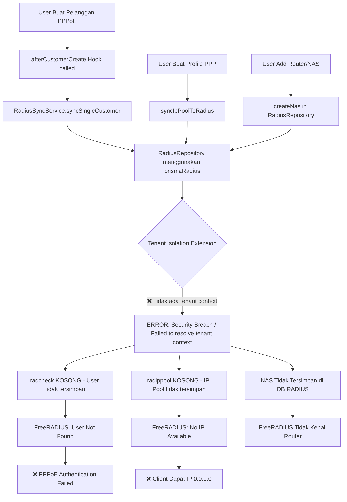

# Audit & Fix: Full RADIUS Flow (End-to-End)

## Problem Summary

Seluruh flow RADIUS gagal saat deploy di server kosong. Berikut temuan audit:

### Root Cause Analysis



### Masalah yang Ditemukan

| # | Masalah | File | Dampak |
|---|---------|------|--------|
| 1 | **prismaRadius menggunakan tenant isolation** tanpa ignore list. Hooks dipanggil TANPA tenant context → semua query RADIUS gagal silent | `lib/prisma-radius.ts` | radcheck, radippool, radusergroup, radgroupreply semua KOSONG |
| 2 | **NAS tidak tersimpan** di tabel `nas` database RADIUS | `app/api/mikrotik-routers/route.ts` | FreeRADIUS tidak mengenali router |
| 3 | **radippool kosong** - IP Pool tidak diisi saat Profile PPP dibuat | `app/api/profileppps/route.ts` | Client PPPoE dapat IP 0.0.0.0 |
| 4 | **FreeRADIUS sqlippool queries** kemungkinan tidak cocok dengan schema | `radius/` configs | IP allocation gagal |
| 5 | **clients.conf** `require_message_authenticator = yes` bisa konflik | `config/radius/clients.conf` | Packet ditolak |

> [!CAUTION]
> **Root cause #1 (Tenant Isolation)** adalah penyebab utama dari semua masalah. Memperbaiki ini akan menyelesaikan 80% masalah sekaligus.

## User Review Required

> [!IMPORTANT]
> **Perubahan pada Tenant Isolation untuk RADIUS Database**
> 
> Tabel-tabel RADIUS (`radcheck`, `radreply`, `radippool`, dll) perlu DIEXCLUDE dari tenant isolation karena:
> 1. FreeRADIUS query langsung tanpa tenant context
> 2. Hook `afterCustomerCreate` berjalan di server context (bukan HTTP request) → tidak ada session/tenant
> 
> Solusi: Gunakan `prismaRadiusAuth` (tanpa extension) untuk operasi RADIUS, atau tambahkan semua model RADIUS ke ignore list.

## Proposed Changes

### Component 1: Fix Tenant Isolation untuk RADIUS

#### [MODIFY] [prisma-radius.ts](file:///Users/rohadimraja/Documents/radpro/netmanager/lib/prisma-radius.ts)
- Ubah `withTenantIsolation([])` menjadi `withTenantIsolation(['radcheck', 'radreply', 'radusergroup', 'radgroupcheck', 'radgroupreply', 'radpostauth', 'radacct', 'radippool', 'nas'])`
- Ini mengexclude SEMUA tabel RADIUS dari tenant isolation karena:
  - FreeRADIUS butuh akses langsung tanpa tenant context
  - Hook-hook sync berjalan di server context

> [!NOTE]
> Multi-tenancy pada tabel RADIUS sudah di-handle manual oleh `RadiusRepository` yang menerima `tenantId` sebagai parameter eksplisit dan menyimpannya sebagai kolom biasa.

---

### Component 2: Fix NAS Sync ke Database RADIUS

#### [MODIFY] [route.ts](file:///Users/rohadimraja/Documents/radpro/netmanager/app/api/mikrotik-routers/route.ts)
- Perbaiki sync NAS agar menggunakan `prismaRadiusAuth` (bypass tenant isolation)
- Tambahkan error handling dan logging yang lebih baik

#### [MODIFY] [route.ts](file:///Users/rohadimraja/Documents/radpro/netmanager/app/api/mikrotik-routers/[id]/route.ts)  
- Perbaiki update NAS agar konsisten

---

### Component 3: Fix clients.conf (Hapus require_message_authenticator)

#### [MODIFY] [clients.conf](file:///Users/rohadimraja/Documents/radpro/netmanager/config/radius/clients.conf)
- Ubah `require_message_authenticator = yes` menjadi `no` pada wildcard `all_routers`
- Pertahankan `yes` pada localhost (untuk keamanan health check)

---

### Component 4: Pastikan sqlippool Queries Benar

#### Audit file `sqlippool.conf` di container RADIUS
- Verifikasi query `allocate_find`, `allocate_update`, `start_update` cocok dengan schema tabel `radippool`
- Pastikan kolom `framedipaddress` (bukan `FramedIPAddress`) digunakan

---

## Verification Plan

### Automated Tests
1. Deploy ulang setelah fix
2. Test flow lengkap:
   ```
   Add Router/NAS → Verify tabel nas terisi
   Create Profile PPP (RADIUS mode + IP Range) → Verify radippool terisi
   Create Bandwidth → Create Harga Paket → Verify radgroupreply terisi
   Create Pelanggan PPPoE (AKTIF) → Verify radcheck terisi + radusergroup terisi
   Test koneksi PPPoE dari MikroTik → Verify Access-Accept + IP assigned
   ```

### Manual Verification
- Cek log FreeRADIUS setelah deploy: tidak boleh ada error `relation does not exist`
- Cek dari MikroTik: `ppp active print` harus menunjukkan IP yang benar (bukan 0.0.0.0)
