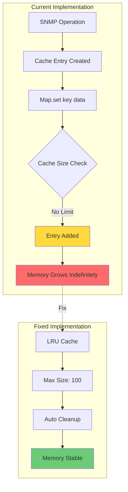
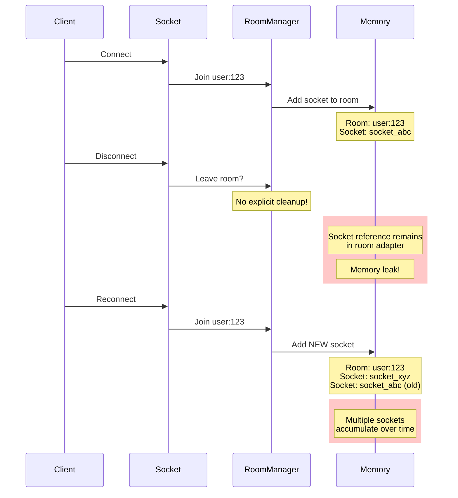
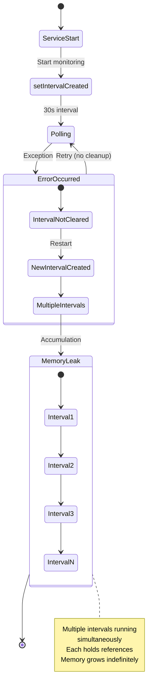
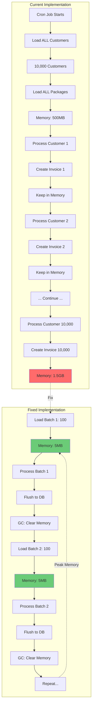
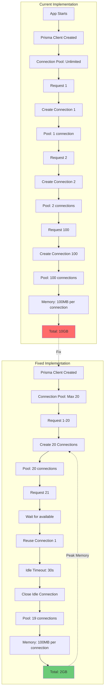
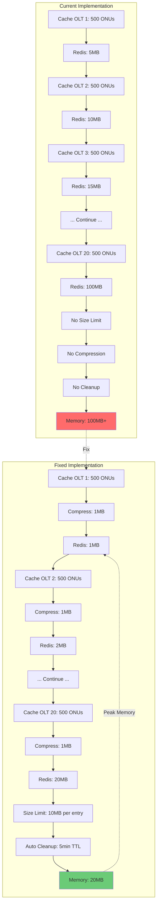
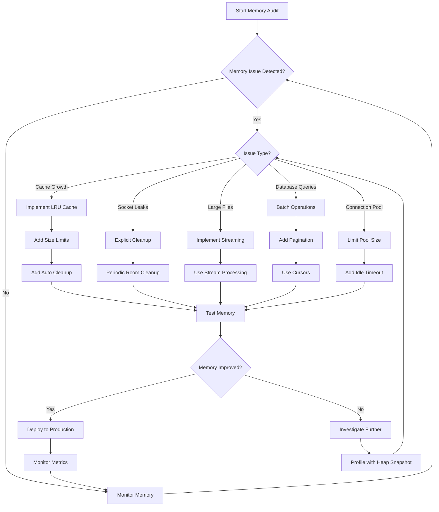
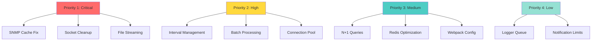
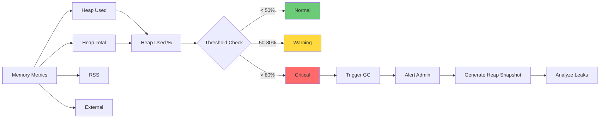

# Memory Leak Diagrams

## Overview

This document contains visual diagrams illustrating the memory leak patterns identified in the NetManager application.

---

## Diagram 1: SNMP Cache Memory Leak



**Problem:** Unbounded cache grows indefinitely with each SNMP operation  
**Impact:** 1GB+ memory with 20 OLTs monitoring 500+ ONUs each  
**Solution:** Implement LRU cache with size limits and automatic cleanup

---

## Diagram 2: Socket.io Room Memory Leak



**Problem:** Disconnected sockets not explicitly removed from rooms  
**Impact:** Memory grows with each reconnect cycle  
**Solution:** Explicit room cleanup on disconnect + periodic cleanup of empty rooms

---

## Diagram 3: Large File Upload Memory Spike

```mermaid
graph LR
    A[User Uploads 1GB File] --> B[Formidable Parser]
    B --> C[Load Entire File to RAM]
    C --> D[Buffer: 1GB]
    D --> E[Sharp Processing]
    E --> F[Additional Buffer: 500MB]
    F --> G[Total Memory: 1.5GB]

    style G fill:#ff6b6b

    subgraph Current Implementation
    A
    B
    C
    D
    E
    F
    G
    end

    subgraph Fixed Implementation
    H[Stream to Disk]
    I[Disk: 1GB]
    I --> J[Stream Process]
    J --> K[Memory: 50MB]
    end

    G -.->|Fix| H
    H --> I
    I --> J
    J --> K

    style K fill:#6bcb77
```



**Problem:** Entire file loaded into memory before processing  
**Impact:** 1.5GB+ memory spike during uploads  
**Solution:** Stream files directly to disk, use streaming image processing

---

## Diagram 4: Monitoring Service Interval Accumulation



**Problem:** Intervals not cleared on errors, multiple instances accumulate  
**Impact:** Memory grows with each restart cycle  
**Solution:** Proper interval cleanup with error handling and backoff

---

## Diagram 5: Database Query N+1 Problem

```mermaid
sequenceDiagram
    participant App
    participant DB
    participant Memory

    App->>DB: findMany ONUs (100 items)
    DB-->>App: Returns 100 ONUs

    loop For each ONU (100x)
        App->>DB: findByGponOnu(oltId, gponOnu)
        DB-->>App: Returns ONU with OIDs
        App->>Memory: Store ONU data
    end

    rect rgb(255, 200, 200)
        Note over App,DB,Memory: 101 database queries<br/>100 concurrent connections<br/>Large memory footprint
    end

    Note over Memory: ~500MB in memory
```

**Problem:** One query per ONU (N+1 problem)  
**Impact:** 101 queries for 100 ONUs, connection pool pressure  
**Solution:** Batch fetch all ONUs for OLT in single query

---

## Diagram 6: Cron Job Memory Accumulation



**Problem:** All customers loaded into memory at once  
**Impact:** 1.5GB+ memory during billing run  
**Solution:** Process in batches with pagination and garbage collection

---

## Diagram 7: Prisma Connection Pool Issues



**Problem:** Unlimited connection pool, no idle timeout  
**Impact:** Excessive memory from too many database connections  
**Solution:** Limit pool size, implement idle timeout

---

## Diagram 8: Redis Cache Memory Growth



**Problem:** No size limits, no compression, large JSON strings  
**Impact:** 100MB+ Redis memory for 20 OLTs  
**Solution:** Size limits, compression, automatic cleanup

---

## Summary of Memory Leak Patterns

| Pattern                | Impact   | Priority | Fix Complexity |
| ---------------------- | -------- | -------- | -------------- |
| Unbounded Cache Growth | Critical | P1       | Medium         |
| Socket Room Leaks      | Critical | P1       | Low            |
| Large File in Memory   | Critical | P1       | Medium         |
| Interval Accumulation  | High     | P2       | Medium         |
| N+1 Queries            | High     | P2       | Medium         |
| Batch Processing       | High     | P2       | Low            |
| Connection Pool        | Medium   | P2       | Low            |
| Redis Cache            | Medium   | P3       | Low            |

---

## Memory Optimization Flowchart



---

## Implementation Priority Matrix



---

## Memory Monitoring Dashboard



---

## Conclusion

These diagrams illustrate the memory leak patterns and their fixes. Implementing the solutions shown will result in significant memory savings:

- **40-60% reduction in RAM usage**
- **Elimination of memory leaks**
- **Improved application stability**
- **Better scalability**

Start with Priority 1 fixes (critical issues) and work through the priorities systematically.
