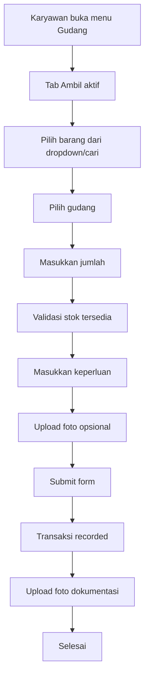
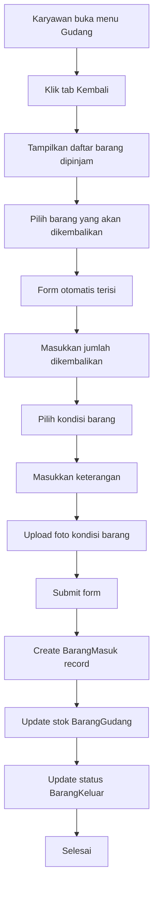

# Spesifikasi Desain Ulang Menu Inventory Menjadi "Gudang"

## 1. Analisis Sistem Saat Ini

### 1.1. Fitur Existing
- **Menu "Ambil Barang"** di `/employee/inventory` dengan:
  - Form pengambilan barang dengan validasi stok
  - Pencarian barang di `/employee/inventory/items`
  - Upload foto dokumentasi
  - Proses transaksi ke API `/api/inventory/keluar`

### 1.2. Struktur Database
- **BarangKeluar**: Tracking barang yang diambil karyawan
- **BarangMasuk**: Tracking barang masuk (termasuk pengembalian)
- **BarangGudang**: Stok aktual per gudang
- **Employee**: Data karyawan

### 1.3. API Endpoints
- `GET/POST /api/inventory/keluar` - Pengambilan barang
- `GET/POST /api/inventory/masuk` - Barang masuk (admin only)
- `GET /api/inventory/barang` - Data barang
- `POST /api/inventory/upload-photo` - Upload foto

## 2. Konsep Desain Baru: "Gudang"

### 2.1. Perubahan Navigasi
- **Dari**: "Ambil Barang" 
- **Menjadi**: "Gudang"
- **Lokasi**: `/employee/warehouse` (redirect dari `/employee/inventory`)

### 2.2. Struktur Menu dengan Tab Navigation
```
Gudang
├── Tab "Ambil" (Default)
│   ├── Form pengambilan barang
│   ├── Pencarian barang
│   └── Riwayat pengambilan
└── Tab "Kembali"
    ├── Form pengembalian barang
    ├── Daftar barang yang dipinjam
    └── Riwayat pengembalian
```

## 3. User Flow Design

### 3.1. Flow Pengambilan Barang (Existing)


### 3.2. Flow Pengembalian Barang (New)


## 4. UI/UX Design

### 4.1. Mobile-First Design Principles
- **Tab Navigation**: Bottom tab untuk mobile, top tab untuk desktop
- **Card-Based Layout**: Informasi dalam card yang mudah di-scroll
- **Touch-Friendly**: Button minimum 44px, spacing yang cukup
- **Progressive Disclosure**: Info detail ditampilkan saat needed

### 4.2. Layout Structure

#### Mobile Layout
```
┌─────────────────────────┐
│ Header: Gudang          │
├─────────────────────────┤
│ ┌─────┐ ┌─────┐       │
│ │Ambil│ │Kembali│      │
│ └─────┘ └─────┘       │
├─────────────────────────┤
│                         │
│  Tab Content Area       │
│                         │
│                         │
└─────────────────────────┘
```

#### Desktop Layout
```
┌─────────────────────────────────────────┐
│ Header: Gudang                        │
├─────────────────────────────────────────┤
│ ┌─────┐ ┌─────┐ ┌─────────────────┐ │
│ │Ambil│ │Kembali│ │ Tab Content    │ │
│ └─────┘ └─────┘ │ Area           │ │
│                           │                 │
│                           │                 │
│                           └─────────────────┘ │
└─────────────────────────────────────────┘
```

### 4.3. Tab "Ambil" Design

#### Header Section
- **Title**: "Ambil Barang"
- **Subtitle**: "Form pengambilan barang untuk keperluan kerja"
- **Icon**: Cube dengan arrow keluar

#### Form Fields
1. **Pilih Barang**: Dropdown dengan search
2. **Pilih Gudang**: Dropdown berdasarkan stok tersedia
3. **Info Stok**: Card showing stok tersedia
4. **Jumlah**: Number input dengan validasi max
5. **Keperluan**: Textarea untuk purpose
6. **Foto Dokumentasi**: Photo upload (opsional)

#### Quick Actions
- **Cari Barang**: Link ke halaman pencarian
- **Riwayat**: Lihat pengambilan sebelumnya

### 4.4. Tab "Kembali" Design

#### Header Section
- **Title**: "Kembalikan Barang"
- **Subtitle**: "Form pengembalian barang yang dipinjam"
- **Icon**: Cube dengan arrow masuk

#### Daftar Barang Dipinjam
- **Card List**: Menampilkan barang yang sedang dipinjam
- **Filter**: Berdasarkan tanggal, status, kategori
- **Search**: Cari barang spesifik

#### Form Pengembalian (Auto-fill)
1. **Info Barang**: Auto-fill dari selection
2. **Jumlah**: Number input (default: jumlah dipinjam)
3. **Kondisi**: Radio button (Baik/Rusak/Hilang)
4. **Keterangan**: Textarea untuk alasan kondisi
5. **Foto Kondisi**: Photo upload (required jika rusak)

## 5. API Design

### 5.1. New API Endpoints

#### GET /api/inventory/employee/items
```typescript
// Get items currently borrowed by employee
Response: {
  borrowedItems: [{
    id: string,
    barangId: string,
    barangKode: string,
    barangNama: string,
    gudangId: string,
    gudangNama: string,
    jumlah: number,
    tanggalAmbil: Date,
    purpose: string,
    kondisi: string,
    fotoBukti: string[]
  }]
}
```

#### POST /api/inventory/return
```typescript
// Process item return
Request: {
  keluarId: string, // Reference to original BarangKeluar
  barangId: string,
  gudangId: string,
  jumlah: number,
  kondisi: 'BAIK' | 'RUSAK' | 'HILANG',
  keterangan: string,
  fotoBukti: string[]
}

Response: {
  message: string,
  masukId: string,
  keluarId: string
}
```

#### GET /api/inventory/employee/history
```typescript
// Get employee transaction history
Query: {
  type: 'keluar' | 'masuk' | 'all',
  page: number,
  limit: number
}

Response: {
  transactions: [...],
  pagination: {...}
}
```

### 5.2. Modified API Endpoints

#### GET /api/inventory/keluar (Enhanced)
- Add filter for `employeeId` to get employee's borrow history
- Add `isReturned` field to track return status

#### POST /api/inventory/masuk (Enhanced)
- Allow employee access for return transactions
- Add `returnReferenceId` to link to original BarangKeluar
- Add validation for return quantity vs borrowed quantity

## 6. Database Schema Updates

### 6.1. New Fields for BarangKeluar
```sql
ALTER TABLE barang_keluar 
ADD COLUMN isReturned BOOLEAN DEFAULT FALSE,
ADD COLUMN returnedAt TIMESTAMP,
ADD COLUMN returnedById STRING,
ADD COLUMN returnMasukId STRING;
```

### 6.2. New Fields for BarangMasuk
```sql
ALTER TABLE barang_masuk
ADD COLUMN isReturnTransaction BOOLEAN DEFAULT FALSE,
ADD COLUMN returnReferenceId STRING; // References barang_keluar.id
```

### 6.3. New Indexes
```sql
CREATE INDEX idx_barang_keluar_employee_returned ON barang_keluar(employeeId, isReturned);
CREATE INDEX idx_barang_masuk_return_transaction ON barang_masuk(isReturnTransaction, returnReferenceId);
```

## 7. Component Structure

### 7.1. Main Components
```
/app/employee/warehouse/
├── page.tsx                    # Main warehouse page with tabs
├── components/
│   ├── TabNavigation.tsx       # Tab switcher component
│   ├── AmbilTab/
│   │   ├── AmbilForm.tsx       # Take item form
│   │   ├── StockInfo.tsx       # Stock display card
│   │   └── RiwayatAmbil.tsx    # Borrow history
│   └── KembaliTab/
│       ├── DaftarPinjaman.tsx   # Borrowed items list
│       ├── KembaliForm.tsx      # Return form
│       └── RiwayatKembali.tsx   # Return history
└── items/
    └── page.tsx                 # Item search page (existing)
```

### 7.2. Shared Components
```
/components/inventory/
├── ItemCard.tsx                # Reusable item card
├── PhotoUpload.tsx             # Photo upload component (existing)
├── StockIndicator.tsx          # Stock level indicator
└── TransactionHistory.tsx       # Transaction history list
```

## 8. Implementation Phases

### Phase 1: Basic Structure (Week 1)
- [ ] Create new `/employee/warehouse` route
- [ ] Implement tab navigation
- [ ] Migrate existing "Ambil Barang" functionality
- [ ] Update navigation in ClientLayout

### Phase 2: Return Functionality (Week 2)
- [ ] Create API endpoints for returns
- [ ] Implement borrowed items list
- [ ] Build return form with validation
- [ ] Database schema updates

### Phase 3: History & Enhancement (Week 3)
- [ ] Implement transaction history
- [ ] Add search and filtering
- [ ] Photo documentation for returns
- [ ] Mobile optimization

### Phase 4: Testing & Deployment (Week 4)
- [ ] End-to-end testing
- [ ] Performance optimization
- [ ] User acceptance testing
- [ ] Documentation and deployment

## 9. Technical Considerations

### 9.1. State Management
- Use React state for form handling
- Implement optimistic updates for better UX
- Cache frequently accessed data (barangs, gudangs)

### 9.2. Error Handling
- Validate stock availability before submission
- Handle concurrent stock updates
- Implement retry mechanism for failed uploads

### 9.3. Performance
- Lazy load transaction history
- Implement virtual scrolling for large lists
- Optimize photo uploads with compression

### 9.4. Security
- Validate employee can only return their borrowed items
- Ensure return quantity doesn't exceed borrowed quantity
- Rate limiting for API endpoints

## 10. Success Metrics

### 10.1. User Experience
- Reduce time to complete return process by 50%
- Increase user satisfaction score
- Decrease support tickets related to inventory

### 10.2. Operational Efficiency
- Improve inventory accuracy by 25%
- Reduce manual tracking efforts
- Faster reconciliation of borrowed items

### 10.3. System Performance
- Page load time < 2 seconds
- Form submission < 3 seconds
- 99.9% uptime for inventory operations

---

## Appendix

### A. Mockup References
- Mobile wireframes: [Link to Figma/Mockup]
- Desktop designs: [Link to Figma/Mockup]
- Interaction prototypes: [Link to Figma/Mockup]

### B. API Documentation
- Detailed API specs: [Link to API docs]
- Database schema: [Link to schema docs]

### C. Testing Checklist
- Unit tests for components
- Integration tests for API endpoints
- E2E tests for user flows
- Performance testing
- Security testing